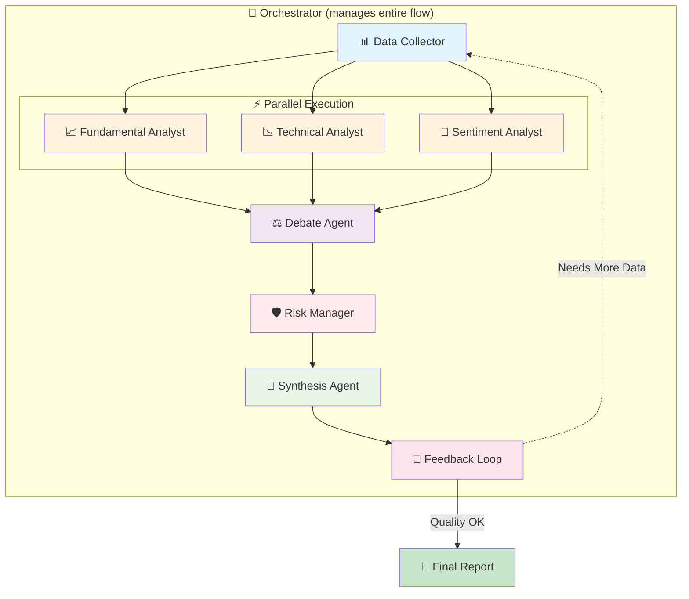

# Agent Workflow Diagram

## Agent Execution Order

| Step | Agent | Description |
|------|-------|-------------|
| 1 | Data Collector | Gathers stock data from Yahoo Finance |
| 2-4 | Fundamental, Technical, Sentiment Analysts | Run in **parallel** |
| 5 | Debate Agent | Creates bull/bear cases |
| 6 | Risk Manager | Assesses risks |
| 7 | Synthesis Agent | Generates final report |
| 8 | Feedback Loop | Quality assurance |
